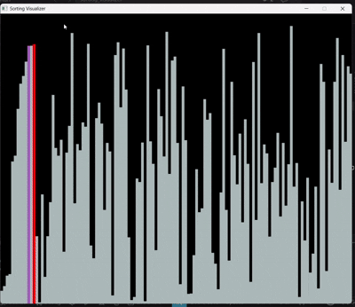
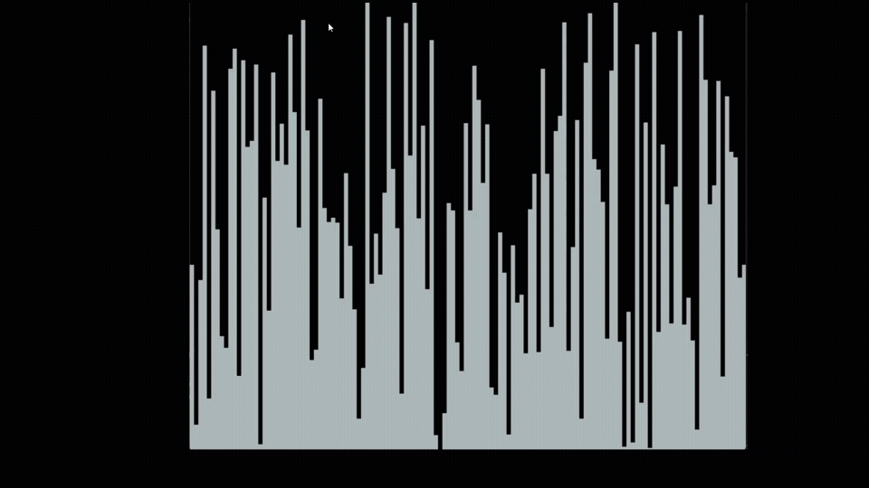
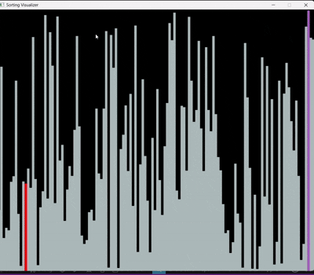
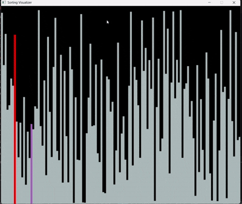

# Sorting Visualizer

A **C++ Sorting Visualizer** built using the **SDL2 graphics library** to visually demonstrate how different sorting algorithms work in real time through animated bar graphs.

---

# Project Overview

This project helps users understand the internal working of sorting algorithms by visualizing:
- comparisons
- swaps
- recursive divisions
- heap operations
- element movements

using animated vertical bars rendered with SDL2.

---

# Features

- Real-time visualization of sorting algorithms
- Randomized array generation
- Interactive keyboard controls
- Smooth graphical rendering using SDL2
- Colored comparisons and swaps
- Supports multiple sorting algorithms
- Animated sorting process with delays for better understanding
- Fixed-size dataset visualization
- Event-driven graphics window
- Console-based control instructions

---

# Sorting Algorithms Implemented

| Algorithm | Type |
|---|---|
| Selection Sort | Comparison Sort |
| Insertion Sort | Incremental Sort |
| Bubble Sort | Exchange Sort |
| Merge Sort | Divide and Conquer |
| Quick Sort | Divide and Conquer |
| Heap Sort | Heap-based Sort |

---

# Data Structures & Algorithms Concepts Used

## Data Structures
- Arrays
- Binary Heap
- Recursion Stack

---

## DSA Concepts
- Sorting Algorithms
- Divide and Conquer
- Recursion
- Heap Operations
- Partitioning Technique
- Array Manipulation
- Swapping Techniques
- In-place Sorting
- Stable vs Unstable Sorting
- Time Complexity Visualization
- Space Complexity Concepts

---

# SDL2 Concepts Used

- SDL Window Creation
- SDL Renderer
- SDL Event Handling
- Real-time Rendering
- Keyboard Input Handling
- Graphics Rendering
- Animation using Delays
- Rectangle Drawing with SDL_Rect
- Frame Updates

---

# Controls

| Key | Action |
|---|---|
| `0` | Generate New Random Array |
| `1` | Selection Sort |
| `2` | Insertion Sort |
| `3` | Bubble Sort |
| `4` | Merge Sort |
| `5` | Quick Sort |
| `6` | Heap Sort |
| `q` | Quit Visualizer |

---

# Screenshots / GIFs

## Bubble Sort


## Selection Sort


## Insertion Sort


## Merge Sort


## Quick Sort


## Heap Sort


---

# Technologies Used

- C++
- SDL2 Library
- Object-Oriented Programming
- Event-Driven Programming

---

# Project Structure

```text
sorting_visualizer/
│
├── output/
│   ├── Bubble_sort.gif
│   ├── Selection_sort.gif
│   ├── Insertion_sort.gif
│   ├── Merge_sort.gif
│   ├── quick_sort.gif
│   └── heap_sort.gif
│
├── sorting.cpp
├── SDL2.dll
├── sorting.exe
└── README.md
```

---

# Build & Run

## Compile

```bash
g++ sorting.cpp -o sorting -lSDL2
```

## Run

```bash
./sorting
```

---

# Learning Outcomes

This project demonstrates:
- visualization of algorithm behavior
- implementation of classic sorting algorithms
- SDL2 graphics programming
- event handling in C++
- recursive algorithm implementation
- rendering animations in real time

---

# Future Improvements

- Add speed control
- Add sound effects
- Add more sorting algorithms
- Add complexity statistics display
- Add pause/resume functionality
- Add customizable array sizes
- Add dark/light themes

---

# Author

**Kourpreetika**